# 🛠️ Coder Buddy

**Coder Buddy** is an AI-powered coding assistant built with [LangGraph](https://github.com/langchain-ai/langgraph). It acts like a team of expert developers working together to build your project from scratch.

## ❓ What is Coder Buddy?

Imagine describing what you want to build in plain English, and an AI team automatically:

- 📋 Plans out the project structure
- 🏗️ Designs the architecture
- 💻 Writes all the code
- ✅ Reviews everything for quality

That's Coder Buddy! You simply describe what you want, and the AI team builds it for you — complete with all files, configurations, and ready-to-run code.

### Perfect For:

- Quick prototypes and MVPs
- Learning how projects are structured
- Building web apps, calculators, to-do lists, and more
- Getting a project started without writing boilerplate code

---

## 🏗️ How It Works

Coder Buddy uses a **multi-agent system** where each AI agent has a specific role:

1. **Planner Agent** 📋
   - Reads your request and creates a detailed project plan
   - Decides which files and features are needed

2. **Architect Agent** 🏗️
   - Takes the plan and breaks it into specific engineering tasks
   - Defines exactly what each file should contain

3. **Coder Agent** 💻
   - Writes the actual code for each file
   - Uses tools like a text editor and terminal, just like a real developer

4. **Reviewer Agent** ✅
   - Reviews all the code for quality and consistency
   - Provides feedback and catches issues

### System Components:

- **Frontend** – A clean web interface where you describe your project and see it being built in real-time
- **Backend** – Handles all the coordination between agents and manages your project files
- **Memory System** – Keeps track of decisions, feedback, and project progress so all agents stay on the same page
- **Tools** – Agents can use a code editor, terminal, and web search to develop like real programmers
- **AI Models** (via Groq API):
  - Planner & Architect & Reviewer use `llama-3.3-70b-versatile`
  - Coder uses `gpt-5.4-mini`

<div style="text-align: center;">
    
</div>

---

## 🚀 Getting Started

### What You'll Need

Before you start, make sure you have:

1. **Python 3.8+** – Install from [python.org](https://python.org)
2. **uv** – A fast Python package installer. [Install it here](https://docs.astral.sh/uv/getting-started/installation/)
3. **Node.js** – For running the frontend. [Install it here](https://nodejs.org/)
4. **Groq API Key** – Free API access for the AI models.
   - Create a Groq account at [console.groq.com](https://console.groq.com/keys)
   - Generate an API key from the dashboard

### Step-by-Step Setup

**Step 1: Clone or Download the Project**

```bash
cd coder-buddy
```

**Step 2: Create and Activate Python Environment**

```bash
uv venv
source .venv/bin/activate  # On Windows: .venv\Scripts\activate
```

**Step 3: Install Python Dependencies**

```bash
uv pip install -r pyproject.toml
```

**Step 4: Set Up Environment Variables**

- Copy the `.sample_env` file and rename it to `.env`
- Open `.env` and add your Groq API key:
  ```
  GROQ_API_KEY=your_api_key_here
  ```

**Step 5: Start the Backend** (Terminal 1)

```bash
uvicorn api:app --reload --port 8000
```

You should see: `Uvicorn running on http://127.0.0.1:8000`

**Step 6: Start the Frontend** (Terminal 2)

```bash
cd frontend/landing-site
npm install  # First time only
npm run dev
```

The app will open at `http://localhost:5173`

### ✨ Try It Out

Now you can describe what you want to build! Try these examples:

- **"Create a to-do list application using HTML, CSS, and JavaScript"**
- **"Create a simple calculator web application"**
- **"Create a simple blog API in FastAPI with a SQLite database"**

Just type your request, click "Generate," and watch the AI team build it!

---

## � System Flow Diagram

This shows how the AI agents work together in a pipeline:

```mermaid
flowchart LR
    start(["▶ Start"]) --> planner["📋 Planner<br/>Analyzes your request<br/>Creates project plan"]
    planner --> architect["🏗️ Architect<br/>Breaks down into tasks<br/>Defines file structure"]
    architect --> coder["💻 Coder<br/>Writes the code<br/>Builds each file"]
    coder --> review{{"✅ Review<br/>Quality check"}}
    review -->|Needs fixes| coder
    review -->|Ready| finish(["🎉 Project Ready!"])

    style start fill:#2E8B57,color:#fff,stroke:#1a5233,stroke-width:2px
    style planner fill:#1E90FF,color:#fff,stroke:#0047AB,stroke-width:2px
    style architect fill:#FF6347,color:#fff,stroke:#CC0000,stroke-width:2px
    style coder fill:#FFD700,color:#000,stroke:#B8860B,stroke-width:2px
    style review fill:#9370DB,color:#fff,stroke:#4B0082,stroke-width:2px
    style finish fill:#32CD32,color:#000,stroke:#228B22,stroke-width:2px
```



**Process Flow:**

1. You describe what you want
2. **Planner** creates a detailed project blueprint
3. **Architect** designs the technical structure
4. **Coder** writes all the code files
5. **Reviewer** checks everything is correct
6. If there are issues, Coder fixes them
7. You get a complete, working project! ✨

---

## 📁 Project Structure

```
coder-buddy/
├── agent/              # The AI agent logic (Planner, Architect, Coder, Reviewer)
│   ├── graph.py       # Multi-agent workflow orchestration
│   ├── states.py      # Shared state between agents
│   ├── prompts.py     # Instructions for each AI agent
│   └── tools.py       # Tools agents can use (file editor, terminal, etc.)
├── frontend/          # Web interface (React + TypeScript)
│   └── landing-site/  # Landing page and user interface
├── generated_projects/ # Folder where AI builds projects
├── api.py            # Backend API (FastAPI)
├── main.py           # Main entry point
├── pyproject.toml    # Python dependencies
└── README.md         # This file!
```

---

## ❓ FAQ

### Q: Do I need to know how to code?

**A:** No! Just describe what you want in plain English, and the AI team will handle the coding.

### Q: What kind of projects can Coder Buddy build?

**A:** It works best with:

- Frontend projects (HTML, CSS, JavaScript)
- Web APIs (FastAPI, Node.js)
- Simple applications and prototypes
- Educational projects

### Q: Does it require internet?

**A:** Yes, you need internet to communicate with the Groq API for the AI models.

### Q: Can I edit the generated code?

**A:** Absolutely! The code is generated in the `generated_projects/` folder and can be edited, deployed, or used as a starting point for your own project.

### Q: What if something goes wrong?

**A:** Check the troubleshooting section below, or check the backend logs (Terminal 1) for error messages.

---

## 🔧 Troubleshooting

**Problem: "ModuleNotFoundError" when running the backend**

- Solution: Make sure you activated the virtual environment and installed dependencies:
  ```bash
  source .venv/bin/activate
  uv pip install -r pyproject.toml
  ```

**Problem: Frontend won't start (npm error)**

- Solution: Make sure Node.js is installed and dependencies are installed:
  ```bash
  cd frontend/landing-site
  npm install
  npm run dev
  ```

**Problem: "GROQ_API_KEY not found"**

- Solution: Check that you created the `.env` file with your API key in the root directory.

**Problem: "Connection refused" between frontend and backend**

- Solution: Make sure the backend is running (`uvicorn api:app --reload --port 8000`) before starting the frontend.

---

## 🤝 Contributing

We'd love your help! Here's how you can contribute:

1. Fork the repository
2. Create a feature branch (`git checkout -b feature/amazing-feature`)
3. Commit your changes (`git commit -m 'Add amazing feature'`)
4. Push to the branch (`git push origin feature/amazing-feature`)
5. Open a Pull Request

---

## 📚 Learn More

- [LangGraph Documentation](https://github.com/langchain-ai/langgraph) – Learn about the framework powering Coder Buddy
- [Groq API Docs](https://console.groq.com/docs) – Understand the AI models
- [FastAPI Docs](https://fastapi.tiangolo.com/) – Backend framework
- [React Docs](https://react.dev/) – Frontend framework

---

## 📄 License

This project is licensed under the MIT License. See LICENSE file for details.

---

**Happy coding! 🚀 Let Coder Buddy help you build amazing projects.**
